<div align="center">

<br>
<strong>━ HESTIA ━</strong><br>
<sub>“Powerful yet simple mod management</sub><br>
<sup>with GameBanana integration”</sup><br>
<a href="https://github.com/HenryNugraha/Hestia/blob/main/CHANGELOG.md"></a> <a href="https://github.com/HenryNugraha/Hestia/releases/latest"></a><br>
</div>
<br>

Hestia is an unofficial mod manager for local XXMI-based mod setups, built to make setup, organization, and day-to-day mod management simpler. The project focuses on a cleaner interface, fewer manual steps, and keeping local mods easy to inspect and maintain.

## Supported Games

- Wuthering Waves
- Arknights: Endfield
- Zenless Zone Zero
- Honkai Star Rail
- Genshin Impact
- Honkai Impact 3rd

Hestia targets games with existing XXMI support, but Hestia itself is independent and is not affiliated with, endorsed by, or maintained by the XXMI developers or projects. If an XXMI-supported game is missing from the list, let me know so I can hook it into the app.

## Features

- Installer and portable builds.
- Automatic path detection, with deep scan fallback for harder setups.
- Manage local mods with enable, disable, archive, restore, rename, and delete actions.
- Manual and bulk mod installation with drag-and-drop support.
- Sort, group, and filter your installed mod library.
- Category management with drag ordering, automatic sorting, and bulk assignment.
- Browse, download, and install mods from GameBanana directly inside the app.
- Auto-create categories from GameBanana categories when downloading mods.
- Resumable downloads for interrupted GameBanana installs.
- Auto-check and update eligible mods.
- Link installed mods to GameBanana pages for metadata and update checks.
- Keep user-made local mod changes from being overwritten by default.
- Personal notes, images, and metadata for local/unlinked mods.
- Built-in Tasks panel for downloads and installs.
- Add shortcuts for external tools and launch them from inside Hestia.
- Keep installed mods usable even after Hestia is removed.
- Optional feedback form with no background telemetry.
- Signed update verification to reduce the risk of tampered app updates.
- Built with Rust for native performance and memory safety.

## Download & Install

Always-latest direct links:
- Installer: <https://hestia.hnawc.com/binary/latest/hestia-setup-latest.exe>
- Portable: <https://hestia.hnawc.com/binary/latest/hestia.exe>

You can also download releases from the [GitHub Releases page](https://github.com/HenryNugraha/Hestia/releases).

Portable version:

1. Download `hestia.exe`.
2. Put it anywhere.
3. Run it.

Installer version:

1. Download the setup executable.
2. Run setup.
3. Launch Hestia.

There is no required install folder. Hestia stores app state beside `hestia.exe` when that folder is writable, and falls back to `%APPDATA%\Hestia` when it is not.

Avoid installing or placing Hestia in write-protected folders such as `Program Files`, especially if you want in-app updates to work without running as administrator. The installer defaults to a per-user folder for this reason.

## First Run

Use the game switcher in the top-left corner to select a game. Hestia will try to detect the expected game, XXMI, and mod paths automatically.

If games are not detected, follow the steps shown in-app.

## Screenshots

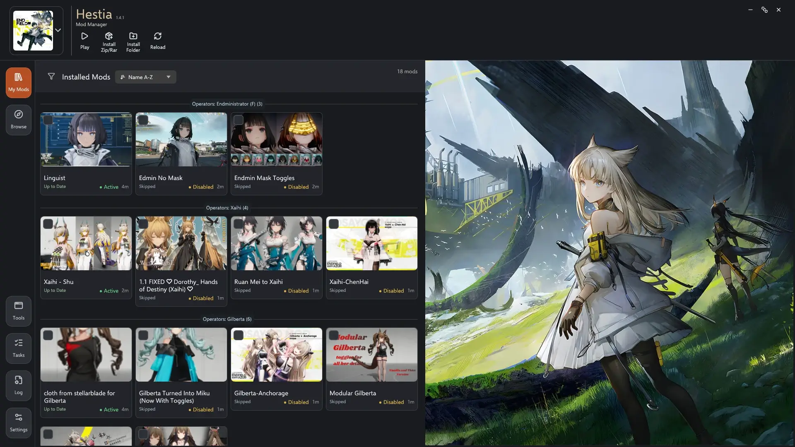
&nbsp; ⤷ Main view with installed mods, thumbnails, categories, and mod states.
<p>&nbsp;</p>

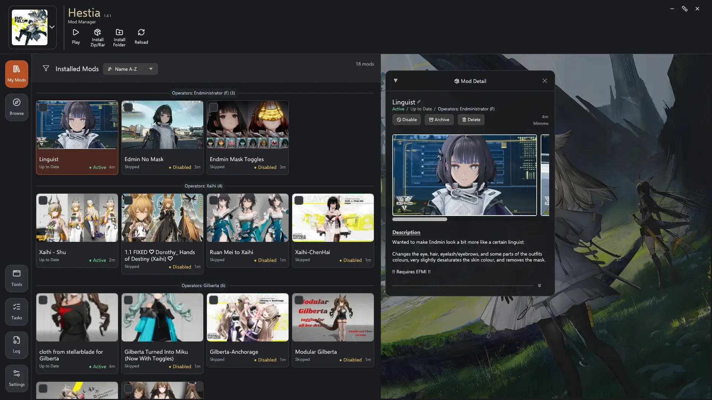
&nbsp; ⤷ Mod detail window with actions, images, description, category, and source information.
<p>&nbsp;</p>

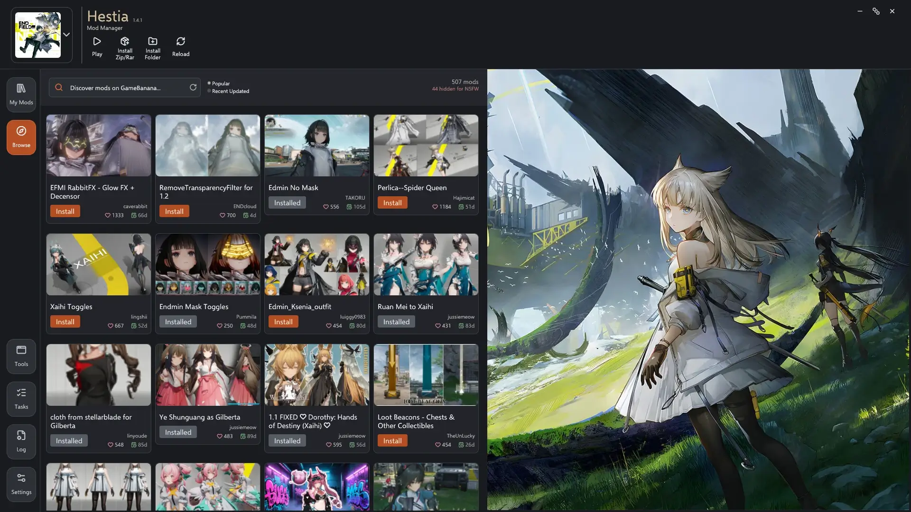
&nbsp; ⤷ Browse GameBanana mods inside Hestia, with install buttons and installed-state detection.
<p>&nbsp;</p>

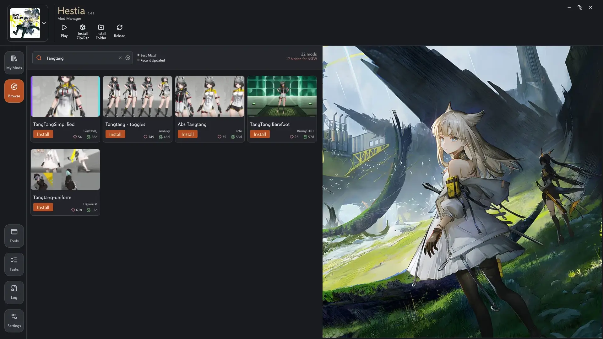
&nbsp; ⤷ Search GameBanana results and switch between best-match and recent-update sorting.
<p>&nbsp;</p>

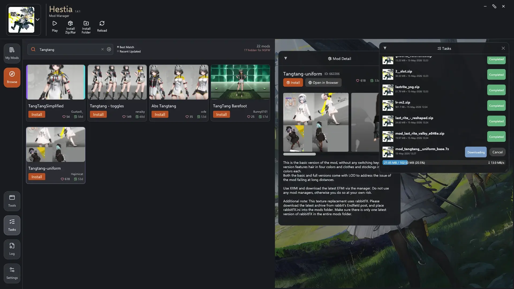
&nbsp; ⤷ Download and install mods while tracking progress in the built-in Tasks window.
<p>&nbsp;</p>

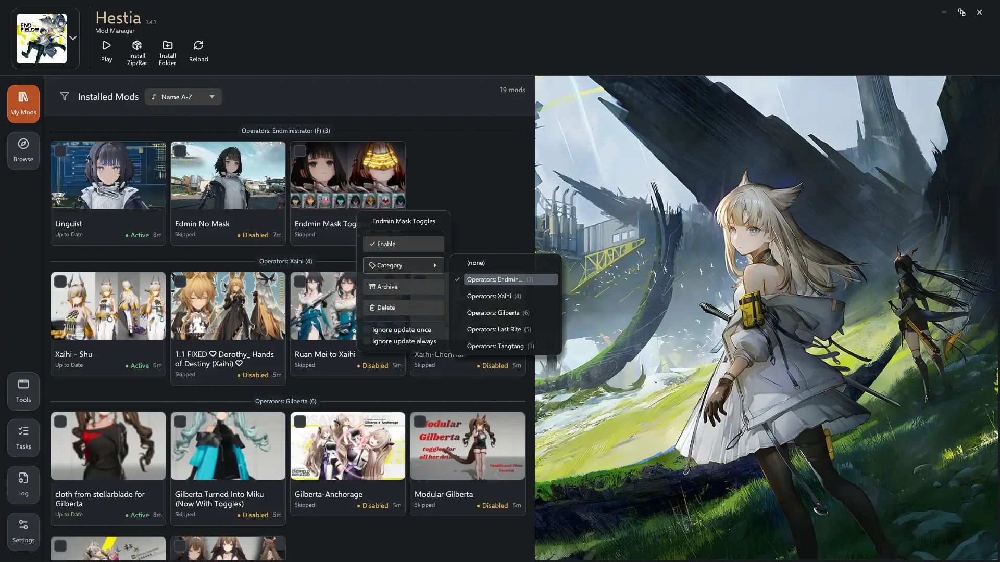
&nbsp; ⤷ Right-click mod actions for enabling, categories, archiving, deleting, and update preferences.
<p>&nbsp;</p>

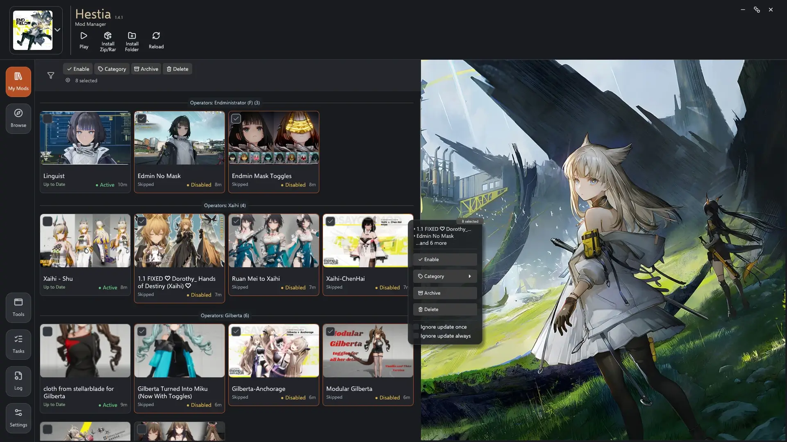
&nbsp; ⤷ Select multiple mods and apply common actions in bulk.
<p>&nbsp;</p>

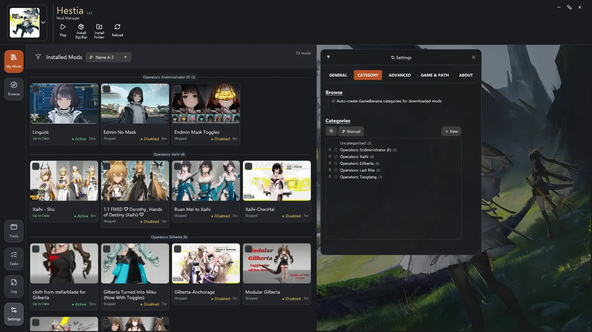
&nbsp; ⤷ Manage categories from Settings, including sorting, manual order, and GameBanana category creation.
<p>&nbsp;</p>

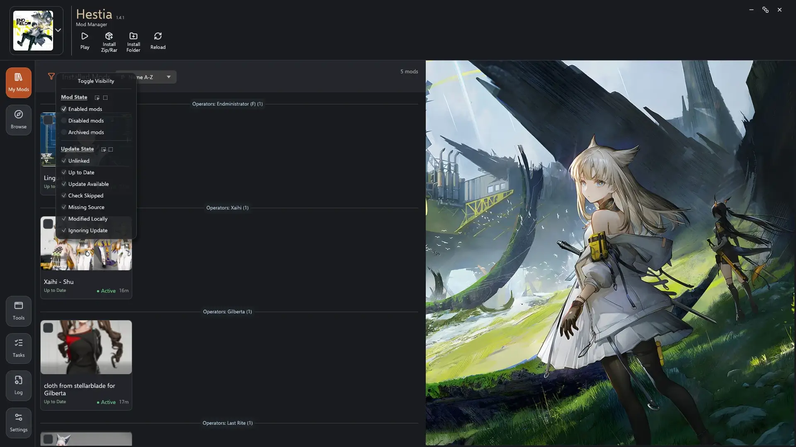
&nbsp; ⤷ Filter installed mods by local state and update state.
<p>&nbsp;</p>

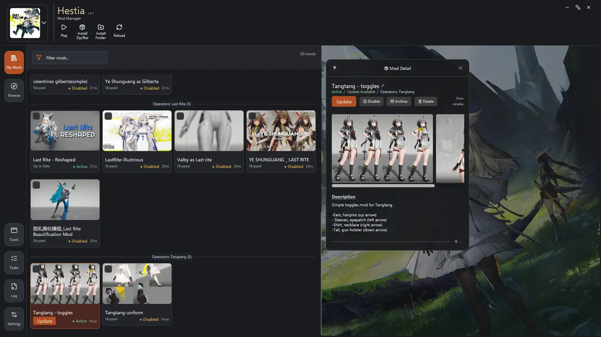
&nbsp; ⤷ Detect available updates and update eligible mods from the mod detail window.
<p>&nbsp;</p>

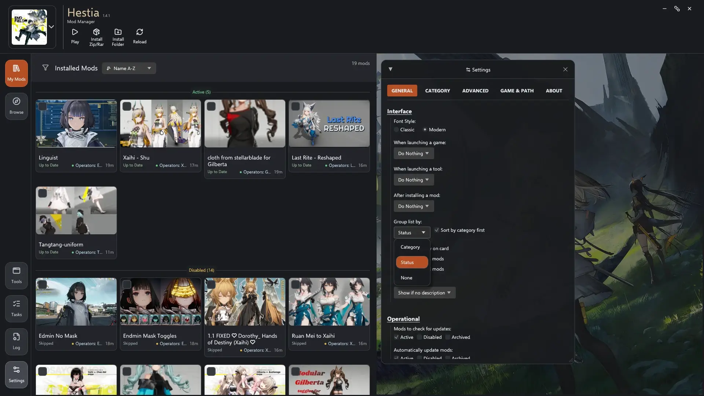
&nbsp; ⤷ Choose how the installed mod list is grouped and how extra card details are displayed.
<p>&nbsp;</p>

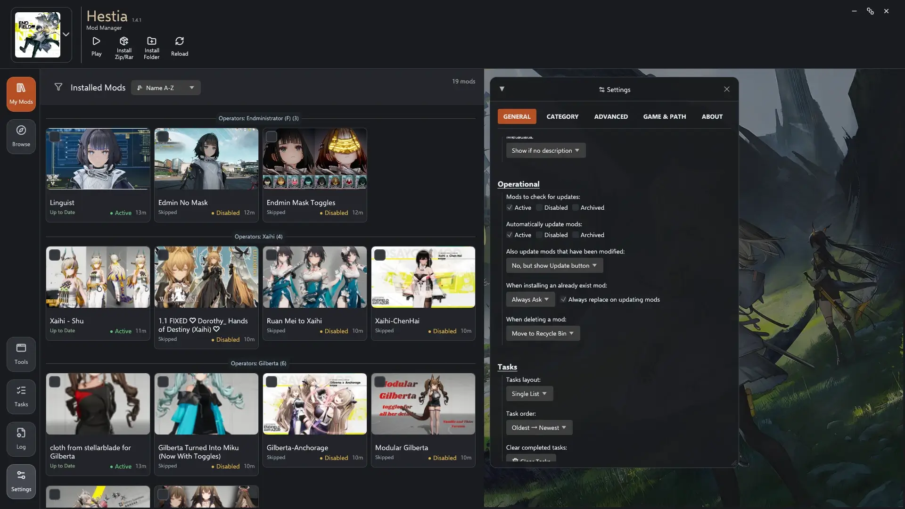
&nbsp; ⤷ Configure update behavior, modified-mod handling, install conflicts, deletion, and task layout.
<p>&nbsp;</p>

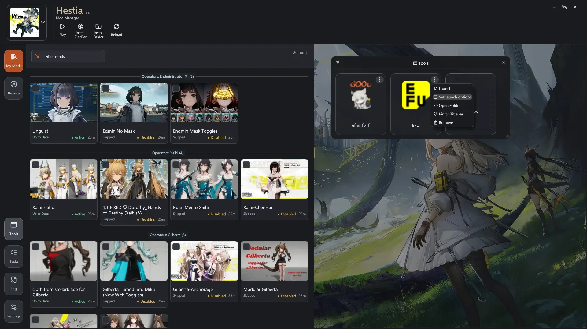
&nbsp; ⤷ Add external tool shortcuts, launch them from Hestia, and pin frequently used tools.
<p>&nbsp;</p>

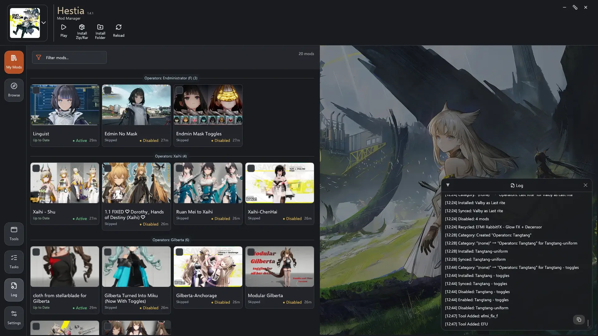
&nbsp; ⤷ Local activity log showing installs, syncs, category changes, and tool actions.
<p>&nbsp;</p>

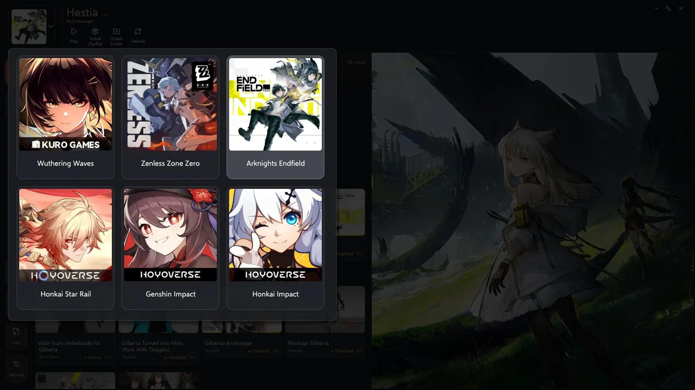
&nbsp; ⤷ Game switcher for supported games.
<p>&nbsp;</p>

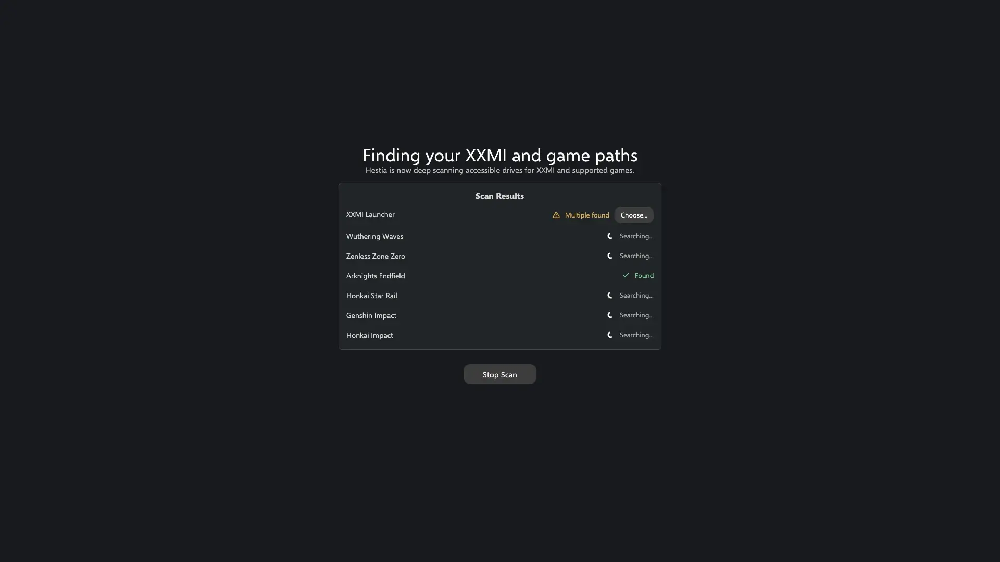
&nbsp; ⤷ Deep scan flow for finding XXMI and supported game paths when automatic detection needs help.

## Building From Source

Requirements:

- Windows
- Rust toolchain with edition 2024 support

Build a release executable:

```powershell
cargo build --release
```

Run from source:

```powershell
cargo run
```

Run tests:

```powershell
cargo test
```

## FAQ

### ※ Is Hestia official?

No. Hestia is an independent project. It is not affiliated with Kuro Games, GRYPHLINE, HoYoverse, miHoYo, Cognosphere, GameBanana, or the XXMI projects.

### ※ Does Hestia include mods?

No. Hestia does not bundle mods.

Hestia can browse, download, and install mods from GameBanana when the files are publicly available and supported by the app. You are responsible for the mods you choose to install and for following the rules of the games, mod authors, and hosting platforms involved.

### ※ Do I need XXMI?

Yes. Hestia is designed for XXMI-based mod setups. Without XXMI, Hestia has no supported mod environment to manage.

### ※ Where are settings saved?

If the folder containing `hestia.exe` is writable, Hestia stores app state beside the executable. If that folder is not writable, Hestia falls back to `%APPDATA%\Hestia`.

Runtime cache and temporary files are stored under `%TEMP%\Hestia`.

### ※ Is it safe to use?

Modding always carries some risk. Hestia does not remove or add the normal risks that come with using XXMI or third-party mods. Hestia itself does not interact directly with the games. It manages files, metadata, downloads, and related tools around your local mod setup.

### ※ What is Hestia’s privacy policy?

Hestia keeps local activity and download records so you can inspect them in the Tasks and Log windows. These records stay on your PC unless you choose to share them manually. Hestia does not include background telemetry or tracking, but has an optional feedback survey that only sends a response if you press `Submit Feedback`, and you can see what data will be included before sending it.

### ※ Can I assign categories to mods?

Yes. Click a mod, then click `Uncategorized` in the mod detail window.

You can also select multiple mods and use the `Category` button to assign them in bulk. First-time users may need to click `+ New Category` to create a category. Categories can be dragged to rearrange their order.

### ※ Can I sort or organize categories?

Yes. Categories can be managed from `Settings → Category`. You can keep manual order, sort by name, or sort by mod count.

### ※ What are Tools?

Tools are external programs you may want to run for a game or mod setup. In many cases, this means a mod fixer after a game version update. Hestia lets you add shortcuts for those tools and launch them from inside the app. Don't worry if you never used any, they are mostly situational.

### ※ What are Tasks?

Tasks are the app's download and install tracker. Use the Tasks panel to see active, completed, or failed mod downloads and installs.

### ※ When does Hestia check my mods for updates?

Hestia checks updates for the currently selected game when the app launches. Changing the selected game also triggers a check. You can click Reload to manually scan and check again.

### ※ Where do Browse mods come from?

The Browse view uses GameBanana.

### ※ Do I need to have a GameBanana account?

No. GameBanana support is an add-on inside Hestia. You can use Hestia only for local mod management, or use the Browse view to explore public GameBanana mods without a GameBanana account.

Browsing GameBanana and supporting creators directly on site is still encouraged, though.

### ※ Why are some mods hidden because of NSFW content?

Hestia can hide or censor content marked as NSFW. You can adjust this in:
`Settings → Advanced → Content Restriction`

### ※ A mod in Browse looks outdated compared with the website. What should I do?

Click Reload. This re-fetches the current Browse data and refreshes the app's browsing cache.

### ※ I do not want Hestia to auto-update my mods.

Adjust auto-update behavior in:
`Settings → General → Operational`

### ※ Why are my mods blank without thumbnail, images or description?

Your mods are most likely in an `unlinked` state.

### ※ What is an unlinked mod?

An unlinked mod is a local mod that is not associated with a GameBanana page. Think of it as offline/local-only. This usually happens when you install a mod outside Hestia's Browse page, such as mods from Patreon.

Hestia cannot check updates for unlinked mods until they are linked to a GameBanana mod page.

If linking the mod is not possible, Hestia still lets you add personal notes and manually assign images in the mod detail window.

### ※ How do I link my mods?

If the mod is on GameBanana, the easiest way is to reinstall them via Hestia's `Browse` page.

You can also manually link it by assigning a GameBanana ID to your installed mods. Click on the mod to open its detail, scroll down past the description, click the double downward arrows in the bottom-right. Under `Source` section, enter the mod's GameBanana URL (example: https://gamebanana.com/mods/652062) or its GameBanana ID (example: 652062) into the input field, then click `Sync Mod` and it will immediately fetch the mod's images and description.

Once the mod is linked, Hestia can check for its update automatically.

### ※ I manually modified my mods. Will Hestia overwrite them?

By default, no. Hestia detects and tries to avoid overwriting locally modified mods. 

You can adjust this behavior in:
`Settings → General → Operational`

### ※ I do not want a certain mod updated.

Click the mod, open the mod detail window, scroll down past the description, click the double downward arrows in the bottom-right, then enable either `Ignore update once` or `Ignore update always`, whichever suit your need.

`Ignore update once` only ignores the currently detected update. If a newer version is detected later, the ignore state is cleared and it will update normally.

### ※ A mod has multiple files and Hestia installs the wrong one when updating.

Some multi-file mods need special handling that cannot be guessed reliably. Open an issue with the mod link and details so the case can be reviewed.

### ※ Can I filter the mod list by status?

Yes. Right-click the filter icon in My Mods to filter by mod status, including active, disabled, archived, unlinked, modified, missing source, and update-related states.

### ※ Can I build my own version?

Yes. Build instructions are above. Forks are welcome, and issues or questions are fine if you need help getting started.

### ※ Does Hestia support Linux or macOS?

Not officially. Hestia is currently Windows-only since that is where I run these games, but I try to keep cross-platform compatibility in mind during development.

If you want to help with Linux or macOS support, feel free to open an issue with details.
