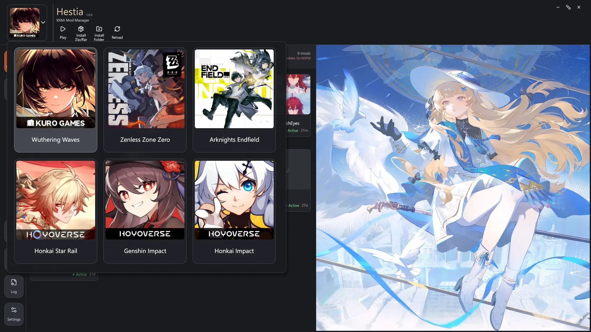
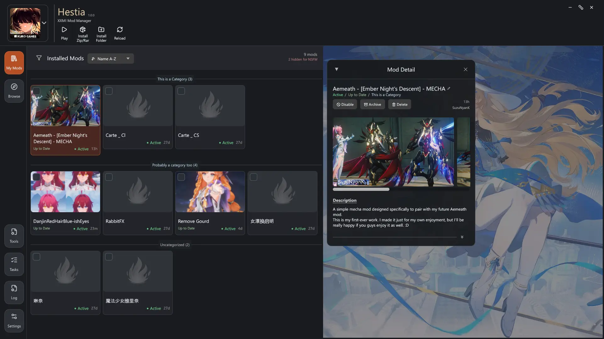
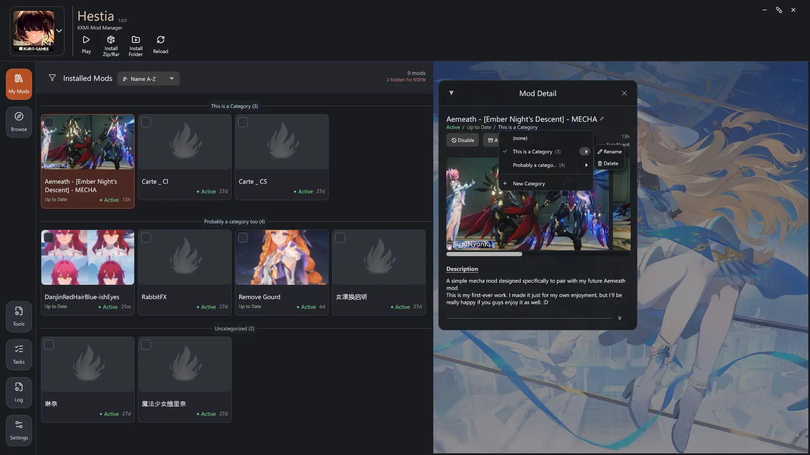
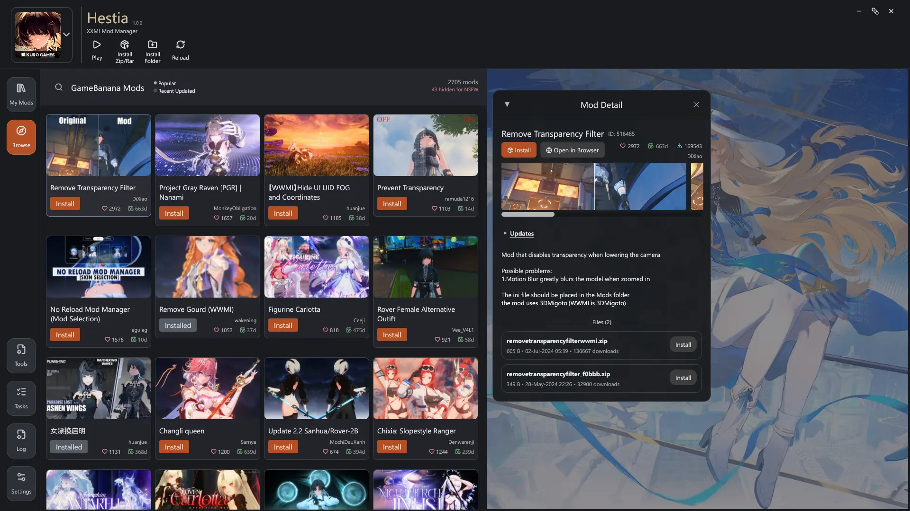
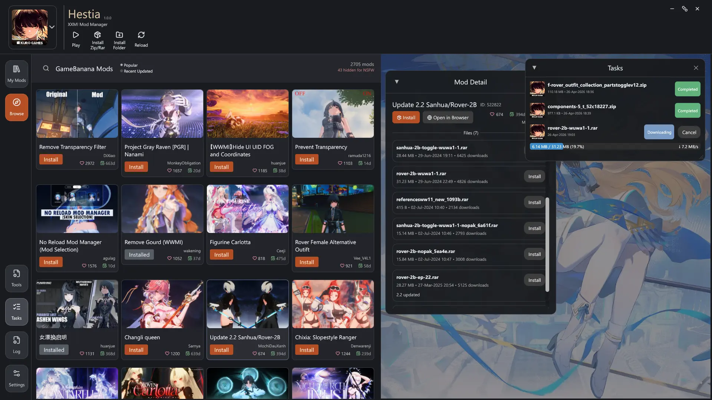
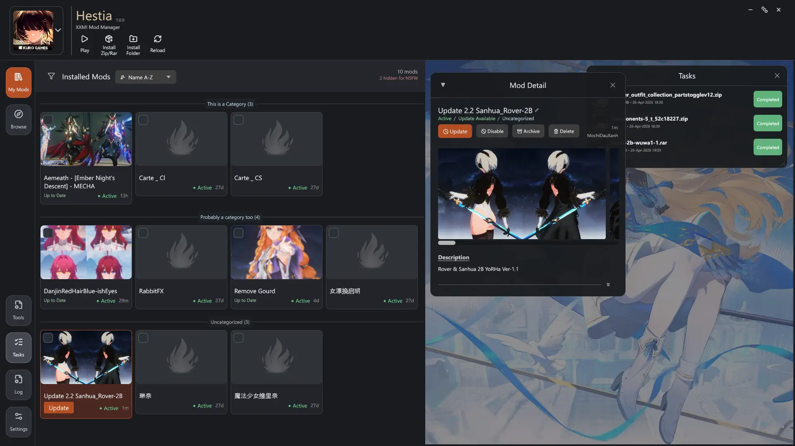
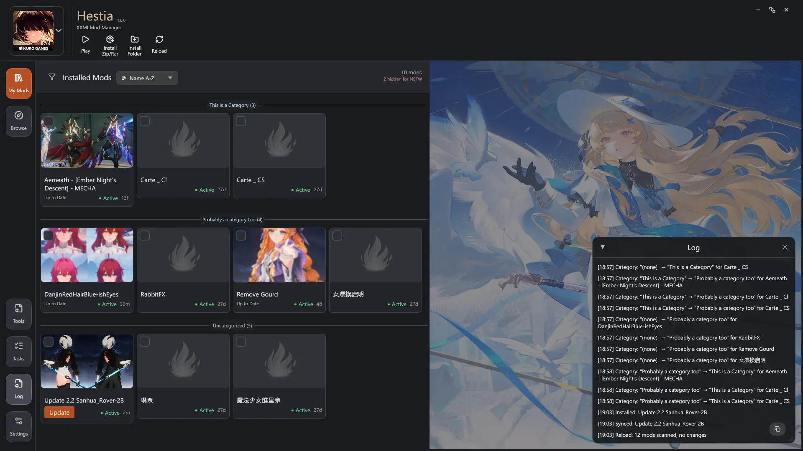
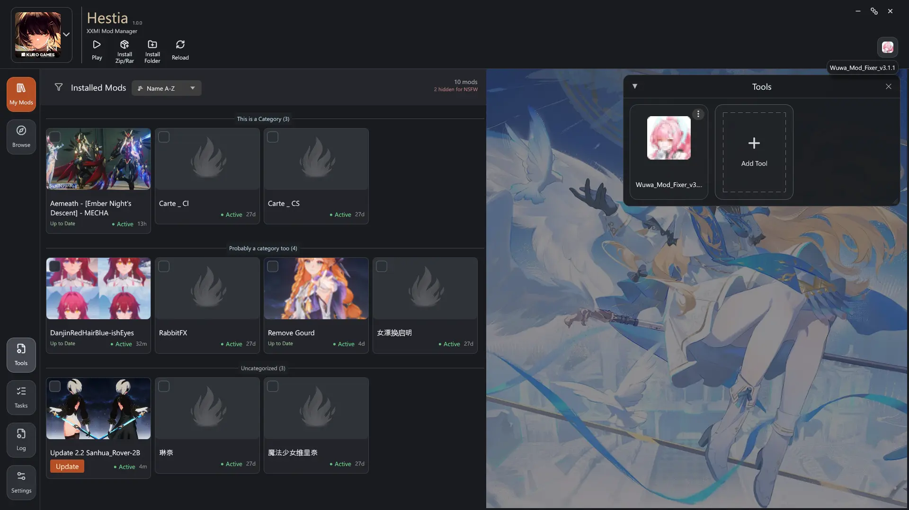

# Hestia

Hestia is a mod manager for games supported by XXMI. I started building it because with the little patience I have, navigating through existing mod managers was not something I could enjoy. The project is built with a heavy focus on user experience to achieve simpler setup, intuitive interface, and fewer manual steps.

## Supported Games

- Wuthering Waves
- Arknights: Endfield
- Zenless Zone Zero
- Honkai Star Rail
- Genshin Impact
- Honkai Impact 3rd

Hestia targets games supported by XXMI. If an XXMI-supported game is missing from the list, let me know so I can hook it into the app.

## Features

- Installer and portable builds: use whichever format you prefer.
- Simplified local mod management.
- Intuitive category management.
- Manual mod installation.
- Bulk mod installation.
- Built-in task manager to track downloads and installs.
- Built-in activity and console log. Logs stay on your PC.
- Enable, disable, archive, restore, rename, and delete mods.
- Browse GameBanana mods inside the app.
- Download and install supported GameBanana mods from inside the app.
- Link installed mods to GameBanana pages.
- Check installed mods against GameBanana for updates.
- Auto-update eligible mods when configured.
- Keep user-made local mod changes from being overwritten by default.
- Discover and launch mod-related tools.
- Keep installed mods usable even after Hestia is removed.
- Built with Rust, with memory-safety guarantees that help prevent classes of bugs such as buffer overflows.
- Built-in signature verifier to harden the update mechanism.

## Download

Always-latest direct links:
- Installer: <https://hestia.hnawc.com/binary/latest/hestia-setup-latest.exe>
- Portable: <https://hestia.hnawc.com/binary/latest/hestia.exe>

You can also download releases from the [GitHub Releases page](https://github.com/HenryNugraha/Hestia/releases).

Portable version:

1. Download `hestia.exe`.
2. Put it anywhere.
3. Run it.

Installer version:

1. Download the setup executable.
2. Run setup.
3. Launch Hestia.

There is no required install folder. Hestia stores app state beside the executable when possible, and falls back to `%APPDATA%\Hestia` when the current folder is not writable.

## First Run

Use the game switcher in the top-left corner to select a game. Hestia will try to detect the expected game, XXMI, and mod paths automatically.

If a game is not detected, follow the steps shown in-app.

## Screenshots

















## Building From Source

Requirements:

- Windows
- Rust toolchain with edition 2024 support

Build a release executable:

```powershell
cargo build --release
```

Run from source:

```powershell
cargo run
```

Run tests:

```powershell
cargo test
```

## FAQ

### Is Hestia official?

No. Hestia is an independent project. It is not affiliated with Kuro Games, GRYPHLINE, HoYoverse, miHoYo, Cognosphere, GameBanana, or the XXMI projects.

### Does Hestia include mods?

No. Hestia does not bundle mods.

Hestia can browse, download, and install mods from GameBanana when the files are publicly available and supported by the app. You are responsible for the mods you choose to install and for following the rules of the games, mod authors, and hosting platforms involved.

### Does Hestia support Linux or macOS?

No. Hestia is currently Windows-only because that is where I use these games and tools.

If you want to help with Linux or macOS support, feel free to open an issue with details.

### Do I need XXMI?

Yes. Hestia is designed for XXMI-based mod setups. Without XXMI, Hestia has no supported mod environment to manage.

### Where are settings saved?

If the folder containing `hestia.exe` is writable, Hestia stores app state beside the executable.

If the folder is not writable, Hestia stores app state in:

```text
%APPDATA%\Hestia
```

Runtime cache and temporary files are stored under:

```text
%TEMP%\Hestia
```

### Is it safe to use?

Modding always carries some risk. Hestia does not remove or add the normal risks that come with using XXMI or third-party mods. Hestia itself does not interact directly with the games. It manages files, metadata, downloads, and related tools around your XXMI setup.


### Can I assign categories to mods?

Yes. Click a mod, then click `Uncategorized` in the mod detail window.

You can also select multiple mods and use the `Category` button to assign them in bulk. First-time users may need to click `+ New Category` to create a category. Categories can be dragged to rearrange their order.

### What are Tools?

Tools are external programs you may want to run for a game or mod setup. In many cases, this means a mod fixer after a game version update. Don't worry if you never used any, they are mostly optional.

### What are Tasks?

Tasks are the app's download and install tracker. Use the Tasks panel to see active, completed, or failed mod downloads and installs.

### When does Hestia check my mods for updates?

Hestia checks updates for the currently selected game when the app launches. Changing the selected game also triggers a check. You can click Reload to manually scan and check again.

### Where do Browse mods come from?

The Browse view uses GameBanana.

### Do I need to have a GameBanana account?

No. GameBanana support is an add-on inside Hestia. You can use Hestia only for local mod management, or use the Browse view to explore GameBanana mods without needing to know the website first. Though, browsing GameBanana directly and support the creators is highly encouraged.

### Why are some mods hidden because of NSFW content?

Hestia can hide or censor content marked as NSFW. You can adjust this in:

```text
Settings > Advanced > Content Restriction
```

### A mod in Browse looks outdated compared with the website. What should I do?

Click Reload. This re-fetches the current Browse data and refreshes the app's browsing cache.

### I do not want Hestia to auto-update my mods.

Adjust auto-update behavior in:

```text
Settings > General > Operational
```

### I manually modified my mods. Will Hestia overwrite them?

By default, no. Hestia detects and tries to avoid overwriting locally modified mods.

### I do not want one mod to update to the currently available version.

Click the mod, open the mod detail window, scroll down past the description, click the double downward arrows in the bottom-right, then enable `Ignore current update`.

This only ignores the currently detected update. If a newer version is detected later, the ignore state is cleared.

### A mod has multiple files and Hestia installs the wrong one when updating.

Some multi-file mods need special handling that cannot be guessed reliably. Open an issue with the mod link and details so the case can be reviewed.

### Can I filter the mod list by status?

Yes. Right-click the filter icon to filter by mod status.

### Can I build my own version?

Yes. Build instructions are above. Forks are welcome, and issues or questions are fine if you need help getting started.
