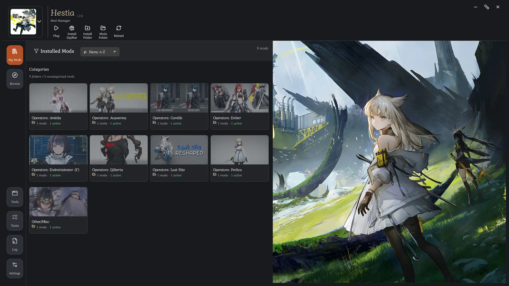
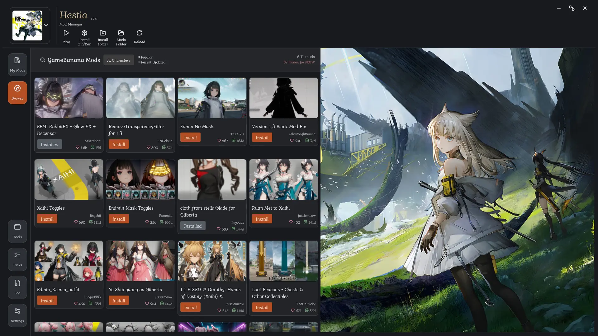
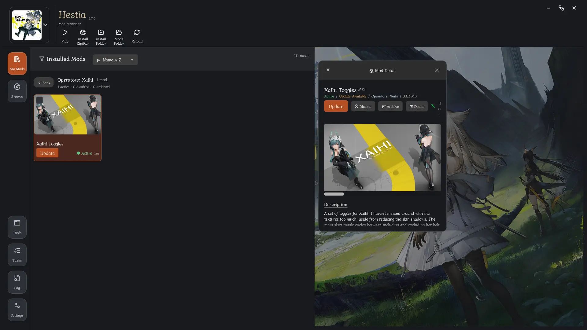
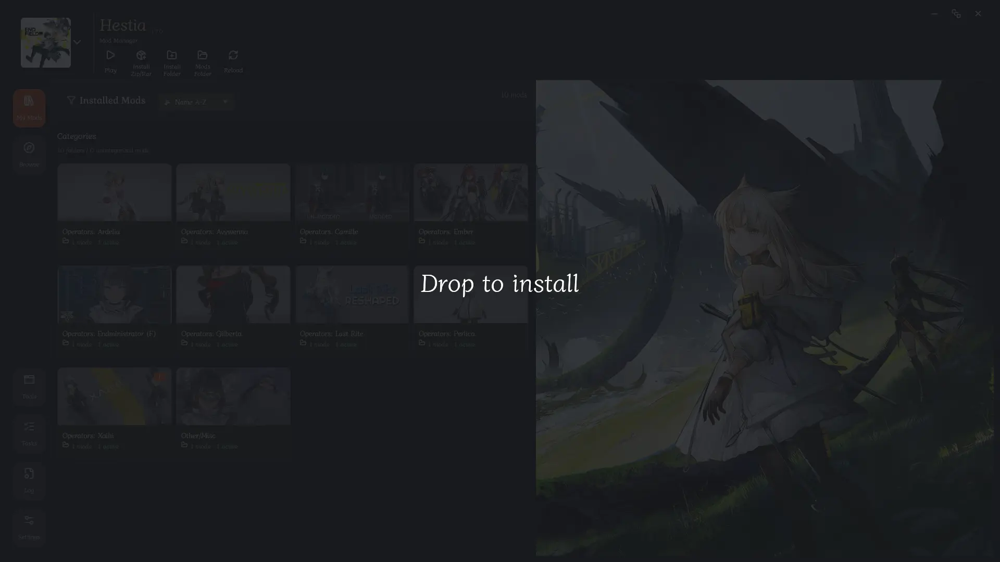
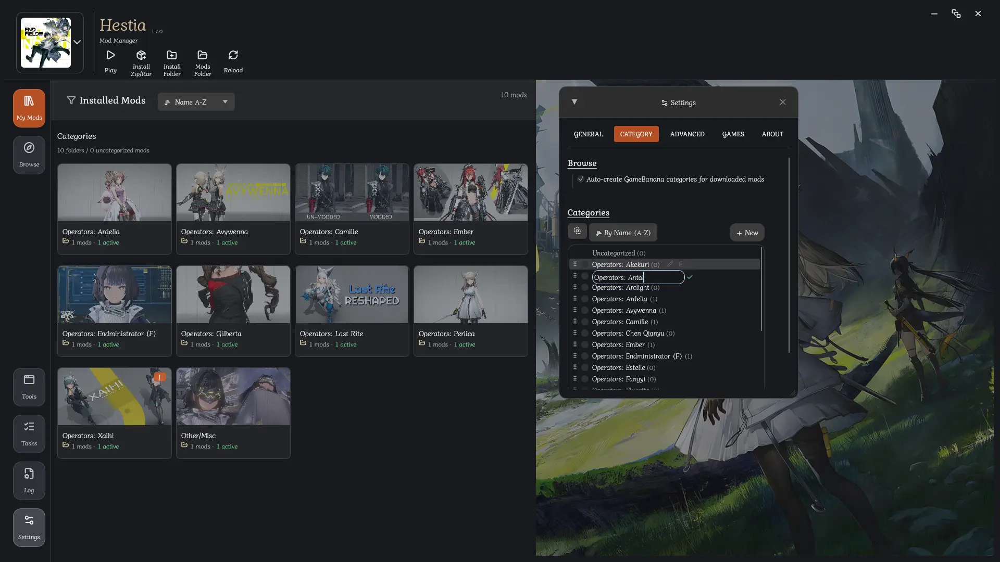

<div align="center">

<br>
<strong>━ [HESTIA](https://hestia.hnawc.com) ━</strong><br>
<sub>“Powerful yet simple mod management</sub><br>
<sup>with GameBanana integration”</sup><br>
<a href="https://github.com/HenryNugraha/Hestia/blob/main/CHANGELOG.md"></a> <a href="https://github.com/HenryNugraha/Hestia/releases/latest"></a><br>
</div>
<br>

Hestia is a feature-rich mod manager for organizing, discovering, installing, and updating mods in one clear interface. It keeps local mod libraries easy to inspect and maintain while reducing the routine work involved in finding mods, managing categories, and checking for updates. Hestia supports XXMI-based games and certain Unreal Engine games.

## Supported Games

| Game | Mod Backend |
| --- | --- |
| Wuthering Waves | [XXMI](https://github.com/SpectrumQT/XXMI-Launcher) |
| Arknights: Endfield | [XXMI](https://github.com/SpectrumQT/XXMI-Launcher) |
| Zenless Zone Zero | [XXMI](https://github.com/SpectrumQT/XXMI-Launcher) |
| Honkai: Star Rail | [XXMI](https://github.com/SpectrumQT/XXMI-Launcher) |
| Genshin Impact | [XXMI](https://github.com/SpectrumQT/XXMI-Launcher) |
| Honkai Impact 3rd | [XXMI](https://github.com/SpectrumQT/XXMI-Launcher) |
| Neverness to Everness | [AyakaNTEBypasser](https://ayakamods.com/mods/ayakantebypasser-nte-signature-bypass.2325/) or [UniversalSigBypasser](https://github.com/rm-NoobInCoding/UniversalSigBypasser) |

## Preview



<details>
<summary>See more</summary>

### Browse GameBanana



### Automatic updates



### Drag & Drop Import



### Organized Category



</details>

## Download

| Format | Description |
| --- | --- |
| [Installer](https://hestia.hnawc.com/binary/latest/hestia-setup-latest.exe) (recommended) | Guided setup, shortcuts, and the easiest first start. |
| [Portable](https://hestia.hnawc.com/binary/latest/hestia.exe) | Use without commitment, then delete whenever you want. Your mods will still work perfectly without Hestia. |

Releases are also available from the [GitHub Releases page](https://github.com/HenryNugraha/Hestia/releases).

> The portable build saves its own settings and cache, but deleting Hestia does not remove or change your existing mods. Avoid placing it in a write-protected folder such as `Program Files` if you want in-app updates to work without administrator privileges.

## Features

### Discover and install

- Browse, search, download, and install mods from GameBanana without leaving Hestia.
- Import individual mods or entire batches using files, folders, archives, or drag and drop.
- Resume interrupted downloads and track progress from the built-in Tasks window.
- Automatically create categories from GameBanana information when downloading mods.

### Organize your library

- Enable, disable, archive, restore, rename, and remove local mods.
- Sort, group, search, and filter libraries containing hundreds or thousands of mods.
- Create, reorder, and automatically sort categories, then assign mods individually or in bulk.
- Add personal notes, images, and metadata to local or unlinked mods.

### Keep updates under control

- Check eligible mods for updates and install new versions automatically.
- Preserve locally modified files by default instead of silently overwriting them.
- Keep disabled mods disabled after an update.
- Link existing local mods to GameBanana for metadata and update checking.
- Choose update preferences for individual mods and handle multi-file releases more reliably.

### Adapt Hestia to your setup

- Use Hestia in English, Bahasa Indonesia, Simplified Chinese, or Russian.
- Translate mod titles, descriptions, and metadata from the mod details window.
- Choose between multiple font sets and customize library grouping and display details.
- Configure a proxy for Hestia's network connections.
- Add shortcuts for external tools and launch them directly from Hestia.
- Navigate common windows and actions with keyboard shortcuts.

## Frequently Asked Questions

### Is Hestia official?

No. Hestia is an independent project and is not affiliated with game publishers, GameBanana, XXMI, or other mod frameworks.

### Does Hestia include mods?

No. Hestia does not bundle mods. It can browse, download, and install publicly available GameBanana files supported by the app.

### Do I need a GameBanana account?

No. You can manage local mods without GameBanana, and public GameBanana content can be browsed without an account. Supporting mod creators directly on GameBanana is still encouraged.

### Is Hestia safe to use?

Modding always carries some risk. Hestia does not interact directly with game services. It manages files, metadata, downloads, and related tools around your local mod setup. App update manifests are cryptographically verified before an update is accepted.

### What data does Hestia collect?

Nothing. Local activity and download records remain on your computer unless you share them. The optional feedback survey sends a response only when you choose to submit it, and you can see the payload before sending.

### Does Hestia support Linux or macOS?

Not officially. Windows is currently the supported platform. Some cross-platform compatibility work exists, but Linux and macOS behavior is not guaranteed.

## Building From Source

Requirements:

- Windows
- A Rust toolchain with Rust 2024 edition support

Build a release executable (it will take a while):

```powershell
cargo build --release
```

Run from source:

```powershell
cargo run
```

Run the test suite:

```powershell
cargo test
```

Issues, bug reports, and development questions are welcome in the [GitHub issue tracker](https://github.com/HenryNugraha/Hestia/issues).

## License

Hestia is licensed under the [GNU Affero General Public License v3.0](LICENSE).
